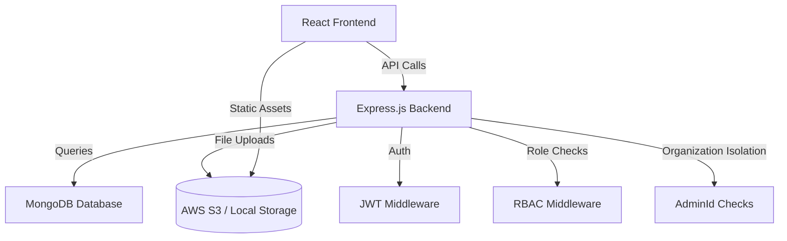

# Student Management System (SMS) Documentation

---

## Table of Contents
- [Overview](#overview)
- [Key Features](#key-features)
- [System Architecture](#system-architecture)
- [Project Structure](#project-structure)
- [Database Design](#database-design)
- [Backend (Express.js) API Documentation](#backend-expressjs-api-documentation)
- [Frontend (React) Structure](#frontend-react-structure)
- [Data Flow Examples](#data-flow-examples)
- [Setup Instructions](#setup-instructions)
- [Usage Guide](#usage-guide)
- [Troubleshooting & Known Issues](#troubleshooting--known-issues)
- [Testing Procedures](#testing-procedures)
- [Security Considerations](#security-considerations)
- [Dependencies](#dependencies)
- [Rendering this Documentation](#rendering-this-documentation)

---

## Overview

The **Student Management System (SMS)** is a full-featured web application built with the MERN stack (MongoDB, Express.js, React, Node.js). It is designed to manage students, teachers, admins, classes, tests (online/offline), scores, analytics, and leaderboards, with robust role-based access and organization isolation. The system is suitable for schools and educational organizations seeking a modern, scalable, and secure management solution.

---

## Key Features
- User registration and login (students, teachers, admins)
- Role-based dashboards and access control
- Class management and assignment
- Test management (online and offline)
- Score management and manual score entry
- Analytics and charts (performance, test stats)
- Leaderboards (class and school-wide)
- Organization isolation (multi-tenant)
- Responsive UI (Tailwind CSS)
- Secure authentication (JWT, bcrypt)

---

## System Architecture



**Data Flow:**
- User interacts with the React frontend
- Frontend sends API requests to Express.js backend
- Backend processes requests, applies authentication/authorization, and interacts with MongoDB
- UI updates based on API responses

---

## Project Structure

```
/d:/sms/
├── server/           # Backend (Express.js, MongoDB)
│   ├── controllers/  # Route logic
│   ├── models/       # Mongoose schemas
│   ├── routes/       # API endpoints
│   ├── middleware/   # Auth, RBAC, etc.
│   ├── utils/        # Helpers
│   ├── config/       # DB config
│   ├── app.js        # Express app
│   ├── index.js      # Server entry
│   └── package.json  # Backend dependencies
├── client/           # Frontend (React)
│   ├── src/
│   │   ├── components/ # Reusable components
│   │   ├── pages/      # Page components (role-based)
│   │   ├── contexts/   # React contexts
│   │   ├── routes/     # Route definitions
│   │   └── App.js      # Main app
│   └── package.json    # Frontend dependencies
└── docs.md           # Project documentation (this file)
```

---

## Database Design

### Collections & Schemas

#### Admins
| Field         | Type      | Constraints                |
|-------------- |---------- |---------------------------|
| _id           | ObjectId  | Primary Key                |
| name          | String    | Required                   |
| email         | String    | Required, Unique           |
| age           | Number    | Required, min 18           |
| extraDetails  | Object    | contact, department        |
| createdAt     | Date      | Default: now               |

#### Teachers
| Field         | Type      | Constraints                |
|-------------- |---------- |---------------------------|
| _id           | ObjectId  | Primary Key                |
| name          | String    | Required                   |
| age           | Number    | Required, min 18           |
| email         | String    | Required, Unique           |
| extraDetails  | Object    | contact, qualifications    |
| isActive      | Boolean   | Default: true              |
| createdAt     | Date      | Default: now               |
| adminId       | ObjectId  | Ref: Admin, Required       |

#### Students
| Field         | Type      | Constraints                |
|-------------- |---------- |---------------------------|
| _id           | ObjectId  | Primary Key                |
| name          | String    | Required                   |
| email         | String    | Required, Unique           |
| age           | Number    | Required, min 5            |
| extraDetails  | Object    | address, parentContact     |
| isActive      | Boolean   | Default: true              |
| createdAt     | Date      | Default: now               |
| adminId       | ObjectId  | Ref: Admin, Required       |

#### Users
| Field         | Type      | Constraints                |
|-------------- |---------- |---------------------------|
| _id           | ObjectId  | Primary Key                |
| name          | String    | Required                   |
| email         | String    | Required, Unique           |
| password      | String    | Required, Hashed           |
| avatar        | String    | Optional                   |
| role          | String    | student/teacher/admin      |
| roleId        | ObjectId  | Ref: Student/Teacher/Admin |
| createdAt     | Date      | Default: now               |

#### Classes
| Field         | Type      | Constraints                |
|-------------- |---------- |---------------------------|
| _id           | ObjectId  | Primary Key                |
| className     | String    | Required                   |
| subjectName   | String    | Required                   |
| teacherId     | ObjectId  | Ref: Teacher, Required     |
| adminId       | ObjectId  | Ref: Admin, Required       |
| studentIds    | [ObjectId]| Ref: Student               |
| createdAt     | Date      | Default: now               |

#### Tests
| Field         | Type      | Constraints                |
|-------------- |---------- |---------------------------|
| _id           | ObjectId  | Primary Key                |
| title         | String    | Required                   |
| type          | String    | Enum, Required             |
| subject       | String    | Required                   |
| classId       | ObjectId  | Ref: Class, Required       |
| teacherId     | ObjectId  | Ref: Teacher, Required     |
| totalMarks    | Number    | Required                   |
| passingMarks  | Number    | Required                   |
| duration      | Number    | Required                   |
| scheduledDate | Date      | Required                   |
| startTime     | String    | Required                   |
| endTime       | String    | Required                   |
| status        | String    | Enum, Default: Scheduled   |
| isActive      | Boolean   | Default: true              |
| createdBy     | ObjectId  | Ref: User, Required        |
| adminId       | ObjectId  | Ref: Admin, Required       |
| testType      | String    | Enum: online/offline       |
| answers       | Object    | Optional                   |
| pdfUrl        | String    | Optional                   |

#### Scores
| Field         | Type      | Constraints                |
|-------------- |---------- |---------------------------|
| _id           | ObjectId  | Primary Key                |
| studentId     | ObjectId  | Ref: Student, Required     |
| testId        | ObjectId  | Ref: Test, Required        |
| classId       | ObjectId  | Ref: Class, Required       |
| score         | Number    | Required                   |
| obtainedMarks | Number    | Required                   |
| totalMarks    | Number    | Required                   |
| submissionDate| Date      | Default: now               |
| isActive      | Boolean   | Default: true              |
| adminId       | ObjectId  | Ref: Admin, Required       |

#### StudentTestAttempts
| Field         | Type      | Constraints                |
|-------------- |---------- |---------------------------|
| _id           | ObjectId  | Primary Key                |
| studentId     | ObjectId  | Ref: User, Required        |
| testId        | ObjectId  | Ref: Test, Required        |
| classId       | ObjectId  | Ref: Class, Required       |
| startTime     | Date      | Required                   |
| endTime       | Date      | Optional                   |
| submittedAnswers| Map     | Key: questionId, Value: answer |
| score         | Number    | Default: 0                 |
| status        | String    | Enum, Default: in-progress |
| isActive      | Boolean   | Default: true              |
| adminId       | ObjectId  | Ref: Admin, Required       |

### Indexes
- Unique: `User.email`, `Teacher.email`, `Student.email`
- Compound: `Score.classId, score` (for leaderboard)
- Others: `Test.teacherId`, `Test.classId`, `Class.teacherId`, `Class.adminId`, `Score.studentId`, `StudentTestAttempt.studentId, testId`

---

## Backend (Express.js) API Documentation

### Authentication
- **POST /api/auth/register/teacher** — Register a new teacher
- **POST /api/auth/register/student** — Register a new student
- **POST /api/auth/login** — Login (all roles)
- **GET /api/auth/me** — Get current user profile
- **PUT /api/auth/profile** — Update profile
- **PUT /api/auth/password** — Change password

### User Management
- **GET /api/admins** — List admins
- **POST /api/admins** — Create admin
- **GET /api/admins/:id** — Get admin by ID
- **PUT /api/admins/:id** — Update admin
- **DELETE /api/admins/:id** — Delete admin
- **GET /api/teachers** — List teachers
- **POST /api/teachers** — Create teacher
- **GET /api/teachers/:id** — Get teacher by ID
- **PUT /api/teachers/:id** — Update teacher
- **DELETE /api/teachers/:id** — Delete teacher
- **GET /api/students** — List students
- **POST /api/students** — Create student
- **GET /api/students/:id** — Get student by ID
- **PUT /api/students/:id** — Update student
- **DELETE /api/students/:id** — Delete student

### Class Management
- **GET /api/classes** — List classes
- **POST /api/classes** — Create class (admin only)
- **PUT /api/classes/:id** — Update class (admin only)
- **DELETE /api/classes/:id** — Delete class (admin only)
- **POST /api/classes/:id/students** — Enroll student
- **DELETE /api/classes/:id/students/:studentId** — Remove student
- **GET /api/classes/:id/students** — List students in class

### Test Management
- **GET /api/tests** — List tests
- **POST /api/tests** — Create test (admin/teacher)
- **PUT /api/tests/:id** — Update test (admin/teacher)
- **DELETE /api/tests/:id** — Delete test (admin/teacher)
- **GET /api/tests/:id** — Get test details
- **POST /api/offline-tests/create** — Create offline test (teacher)
- **POST /api/offline-tests/score-entry** — Manual score entry (teacher)
- **PUT /api/offline-tests/update-score-entry** — Update manual score (teacher)

#### Example: Create Test (Online)
```http
POST /api/tests
Content-Type: application/json
Authorization: Bearer <token>

{
  "testTitle": "Unit Test 1",
  "subjectName": "Mathematics",
  "classId": "<classId>",
  "type": "Unit Test",
  "totalMarks": 100,
  "passingMarks": 35,
  "duration": 60,
  "scheduledDate": "2024-06-01T09:00:00Z",
  "startTime": "09:00",
  "endTime": "10:00"
}
```
**Response:**
```json
{
  "success": true,
  "data": { /* Test object */ }
}
```

**Validation:** Teachers can only create tests for classes they are assigned to. (See [Known Issues](#troubleshooting--known-issues))

### Score Management
- **GET /api/scores** — List scores (role-based)
- **POST /api/scores** — Create score (admin/teacher)
- **PUT /api/scores/:id** — Update score (admin/teacher)
- **DELETE /api/scores/:id** — Delete score (admin/teacher)
- **GET /api/scores/:id** — Get score details

### Leaderboard
- **GET /api/classes/:classId/leaderboard** — Get class leaderboard (by score)

### Analytics
- **GET /api/analytics/student** — Student analytics (student)
- **GET /api/analytics/class/:classId** — Class analytics (teacher)
- **GET /api/analytics/all** — System-wide analytics (admin)
- **GET /api/analytics/student/:studentId** — Student analytics by ID (admin/teacher)

### Middleware
- **JWT Authentication** — All protected routes
- **Role-based Access** — `authorize('admin', 'teacher', 'student')`
- **Organization Isolation** — `adminId` checks on all queries

---

## Frontend (React) Structure

### Dashboard Structure (by Role)
- **Student:** Tests, Scores, Leaderboard, Test Analytics
- **Teacher:** Classes, Tests, Scores, Analytics
- **Admin:** Users, Classes, Scores, Analytics

### Key Components
- `TestList`, `ScoreSubmissionForm`, `AnalyticsChart`, `ClassList`, `ClassDetails`, `Leaderboard`, `ManualScoreEntry`, `OfflineTestForm`, `Profile`, `Navbar`, `PrivateRoute`, `AdminRoute`, `TeacherRoute`, `StudentRoute`

### Page Flow (React Router)
- `/login` → Login
- `/admin/dashboard` → Admin Dashboard
- `/teacher/dashboard` → Teacher Dashboard
- `/student/dashboard` → Student Dashboard
- `/tests` → Test Management (admin/teacher)
- `/student/tests` → Student Test List
- `/student/tests/:id/take` → Take Test
- `/student/tests/:id/results` → Test Result
- `/classes` → Class List
- `/materials` → Material Management
- `/analytics` → Analytics Dashboard

### UI/UX
- **Styling:** Tailwind CSS
- **Charts:** Chart.js (via react-chartjs-2)
- **Responsive Design:** Mobile-first, accessible

---

## Data Flow Examples

### Example: Teacher Creates Offline Test
1. Teacher fills form in UI →
2. API call: `POST /api/offline-tests/create` →
3. Backend validates teacherId/classId →
4. Test stored in MongoDB →
5. UI updates with new test

### Example: Student Submits Test
1. Student completes test in UI →
2. API call: `POST /api/tests/:id/attempts` →
3. Attempt stored in `StudentTestAttempt` →
4. Score calculated and stored in `Score` →
5. Leaderboard/analytics updated

---

## Setup Instructions

### Prerequisites
- **Windows 11**
- **Node.js** (v14+)
- **MongoDB** (local or Atlas)
- **npm** (v6+)

### Backend Setup
1. Open terminal in `/server`
2. Install dependencies:
   ```bash
   npm install
   ```
3. Create `.env` file:
   ```env
   MONGO_URI=mongodb://localhost:27017/sms
   JWT_SECRET=your_jwt_secret
   PORT=5000
   ```
4. Start backend:
   ```bash
   npm run dev
   # or
   node index.js
   ```

### Frontend Setup
1. Open terminal in `/client`
2. Install dependencies:
   ```bash
   npm install
   ```
3. Create `.env` file:
   ```env
   REACT_APP_API_URL=http://localhost:5000
   ```
4. Start frontend:
   ```bash
   npm start
   ```

### Importing Test Data
- Use `mongoimport` to import sample data:
  ```bash
  mongoimport --db sms --collection admins --file admins.json --jsonArray
  mongoimport --db sms --collection users --file users.json --jsonArray
  ```
- Use **MongoDB Compass** to verify collections and data.

---

## Usage Guide

### For End-Users
- **Register/Login:** Use `/register` or `/login` page
- **Students:** View assigned tests, submit answers, view scores and leaderboard
- **Teachers:** Manage classes, create tests, enter scores, view analytics
- **Admins:** Manage users, classes, view system analytics

### For Administrators
- Add/edit/remove users and classes
- Assign teachers to classes
- Monitor analytics and leaderboards

### For Developers
- Extend modules by adding new routes/controllers/components
- Debug using browser dev tools and Postman
- Test API endpoints with Postman (see [Testing Procedures](#testing-procedures))

---

## Troubleshooting & Known Issues

### Common Issues
- **MongoDB Connection Error:** Check `MONGO_URI` in `.env` and ensure MongoDB is running
- **CORS Issues:** Ensure frontend `REACT_APP_API_URL` matches backend URL
- **Port Conflicts:** Change `PORT` in `.env` if 5000 is in use

### Known Bug: Test Management Validation
- **Issue:** Teachers could create tests for classes they weren't assigned to due to missing validation
- **Fix:** Backend now checks `classData.teacherId === req.user.roleId` before allowing test creation (see `testController.js`)
- **Resolution:** Only assigned teachers can create tests for their classes

---

## Testing Procedures

### API Testing
- Use **Postman** to test endpoints (see [API Documentation](#backend-expressjs-api-documentation))
- Test cases:
  - Unauthorized access (no/invalid token)
  - Invalid input data (missing fields, wrong types)
  - Role-based access (student/teacher/admin)
  - Organization isolation (adminId checks)

### Frontend Testing
- Use browser (Chrome/Edge/Firefox) to test UI/UX
- Test navigation, forms, and role-based dashboards

### Database Testing
- Use **MongoDB Compass** to inspect collections, indexes, and data integrity

---

## Security Considerations
- **JWT Authentication:** All protected routes require a valid JWT
- **Password Hashing:** User passwords are hashed with bcrypt
- **Input Sanitization:** All inputs validated on backend
- **HTTPS:** Recommended for production deployments
- **File Upload Security:** Multer used for uploads, restrict file types/size
- **Organization Isolation:** All queries scoped by `adminId`
- **Rate Limiting:** Express-rate-limit to prevent abuse

---

## Dependencies

### Backend
- express, mongoose, bcryptjs, jsonwebtoken, multer, cors, dotenv, helmet, express-rate-limit, express-async-handler

### Frontend
- react, react-router-dom, axios, tailwindcss, chart.js, react-chartjs-2, @mui/material, @emotion/react, @emotion/styled, framer-motion

### CDN (if used)
- React, Tailwind CSS, Chart.js

---

## Rendering this Documentation
- View this file (`docs.md`) in any Markdown viewer (e.g., VSCode, GitHub, Cursor, Typora)
- For diagrams, use a viewer that supports Mermaid syntax (e.g., GitHub, VSCode with Mermaid plugin)

---

**End of Documentation** 